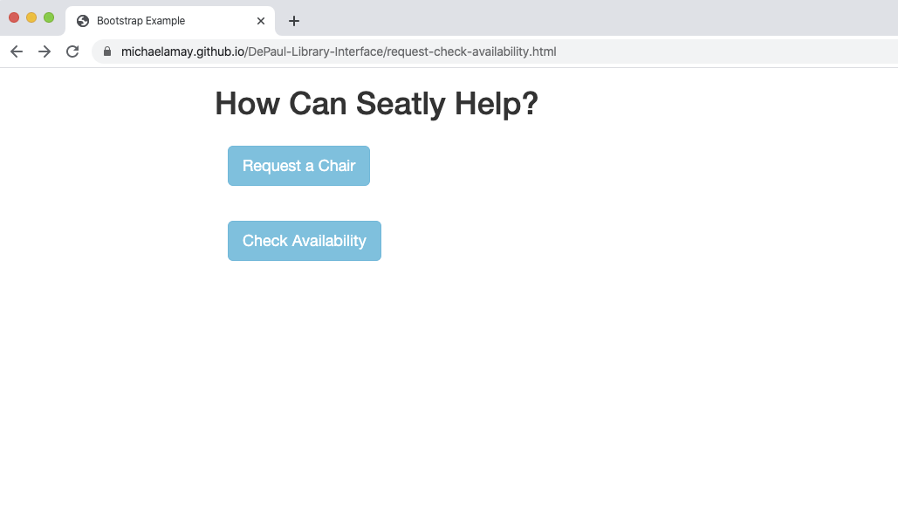
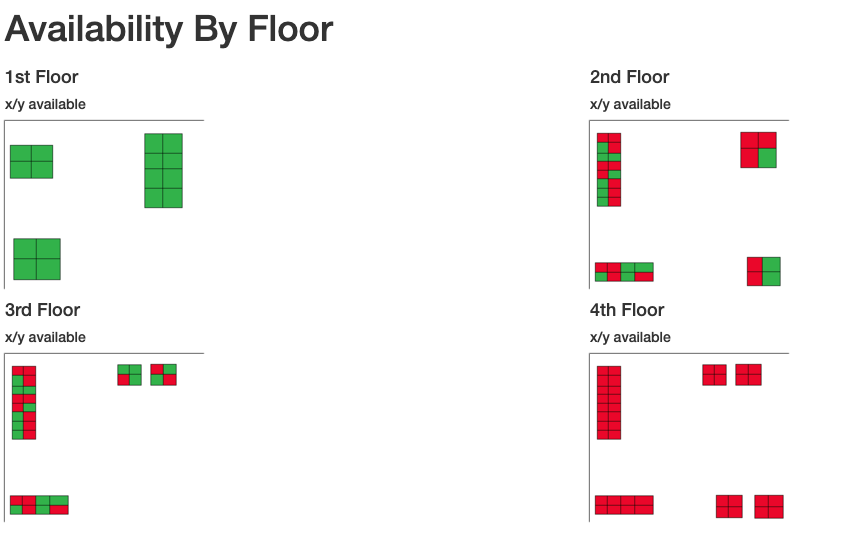
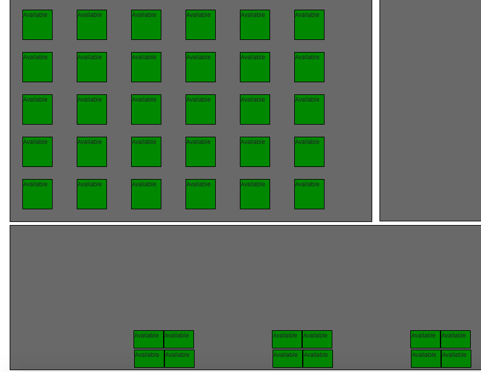

# DePaul-Library-Interface
A conceptional user interactive interface to ease students library experience for checking seat availability and making seat reservations.Students can interactive with the UI prior to enter the library and searching for seats.

<h2>How It Works</h2>

Users can have two main options: make a seat reservation or seating availability by floor plan.

Users can check for quick seat availability by choosing to view an overview floor plan of all 4 floors.

or, only a particular floor plan in more detail

Furthermore, users can request a particular chair and make a reservation

